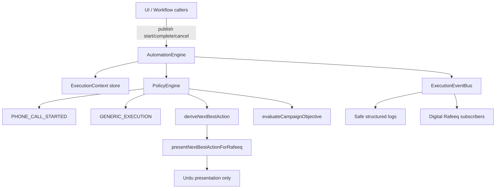

# KC-020 — Execution Context & Automation Framework

Architecture-only foundation. Not a notification system. Not AI. Not a UI redesign.

**Product charter (philosophy & permanent rules):** [`automation-philosophy-charter.md`](./automation-philosophy-charter.md) — **KC-020 CLOSED**.

## Golden rule

```text
Execution action
  → Execution Context
  → Automation Engine starts
  → Human execution
  → Outcome captured
  → Campaign objective evaluated
  → Next Best Action generated
  → Execution Context closed
```

## Architecture



## Package layout

| Path | Role |
|------|------|
| `src/execution/types.ts` | ExecutionContext model + statuses + types |
| `src/execution/events.ts` | Standard execution events |
| `src/execution/eventBus.ts` | In-process pub/sub |
| `src/execution/AutomationEngine.ts` | Lifecycle orchestrator |
| `src/execution/policies/*` | Policy engine + example policies |
| `src/execution/nextBestAction.ts` | Structured NBA contract |
| `src/execution/objectiveEvaluation.ts` | Campaign objective progress |
| `src/execution/rafeeq/presentNextBestAction.ts` | Urdu presentation adapter |
| `src/execution/logging.ts` | Server-safe lifecycle logs |

## Integration points (future)

Call from any execution workflow without redesigning screens:

```ts
import { getAutomationEngine, presentNextBestActionForRafeeq } from '@/execution'

const engine = getAutomationEngine()
const ctx = engine.start({
  executionType: 'phone_call',
  workerId,
  ruknId,
  campaignId,
  objective: { kind: 'first_meeting', statement: '...' },
})

// ... human completes the call ...

const { nextBestAction } = engine.complete({
  executionContextId: ctx.id,
  outcome: { code: 'success', recordedAt: new Date().toISOString() },
})

const rafeeqLine = presentNextBestActionForRafeeq(nextBestAction!)
// rafeeqLine.urdu → companion copy only
```

Pluggable later on the same bus/lifecycle: Google Calendar, WhatsApp, Voice, STT, notifications, scheduled jobs, AI prioritisation.

## Digital Rafeeq separation

- Automation **generates** structured `NextBestAction` codes.
- Digital Rafeeq **presents** them in Urdu via `presentNextBestActionForRafeeq`.
- Rafeeq must not invent action codes.

## Verify

```bash
npm run verify:execution-automation
```
