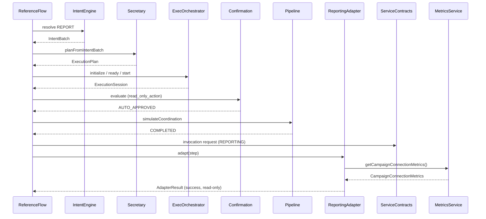

# KC-0131.11 — Reference Execution Flow (Read-Only)

**Status:** Implemented (first functional validation)  
**Standards:** DRDS v1.0 · ARR · KC-0131A · KC-0131.1–9 · [`kc-0131-11-arch009-gate.md`](./kc-0131-11-arch009-gate.md)  
**Module:** `src/conversation/referenceFlow/`  
**Capability:** `REPORTING`  
**Service:** `MetricsService.getCampaignConnectionMetrics()` (existing, unmodified)

---

## Purpose

Validate that Digital Rafeeq can traverse the full architecture stack and safely invoke **one existing read-only** platform service without modifying business data.

This is architectural validation — not a general execution framework expansion.

---

## Sequence diagram

---

## Layer responsibilities

| Layer | Role in this flow |
|-------|-------------------|
| Conversation / Intent | Domain intent `REPORT` → normalized batch |
| Secretary | Immutable `ExecutionPlan` |
| Execution Orchestrator | Session lifecycle coordination |
| Confirmation Orchestrator | `read_only_action` → `AUTO_APPROVED` |
| Execution Pipeline | Stage progression to `COMPLETED` |
| Execution Adapter | Resolve `REPORTING` → reference adapter |
| Service Integration Contract | Immutable invocation request shape |
| MetricsService | Existing read-only metrics snapshot |
| Result | Read-only payload; `performedWork: false` |

---

## Failure path

| Failure | Outcome |
|---------|---------|
| Unsupported capability | Flow rejects before adapter invoke |
| Confirmation denied | Flow stops; no service call |
| Pipeline cancelled | Flow stops; no service call |
| Adapter resolution failure | Flow stops; no service call |
| Service unavailable | Adapter returns error result; no write |

No retry engine.

---

## Observability

Each flow result includes stage metadata suitable for future:

- audit
- metrics
- execution history
- tracing

No telemetry infrastructure is implemented in this sprint.

---

## Extension strategy

1. Keep **exactly one** reference capability until Phase C certifies safety.
2. Additional capabilities require their own tickets and confirmation/pipeline wiring.
3. Never bypass existing KC services or repositories.
4. Writes remain forbidden until Safe Execution Architecture (Phase C).

---

## Constraints

No repository modifications · no Firestore mutations · no AI · no voice · no UI.  
Repositories remain the only source of truth for durable data.

Verify: `npm run verify:kc-0131.11`
