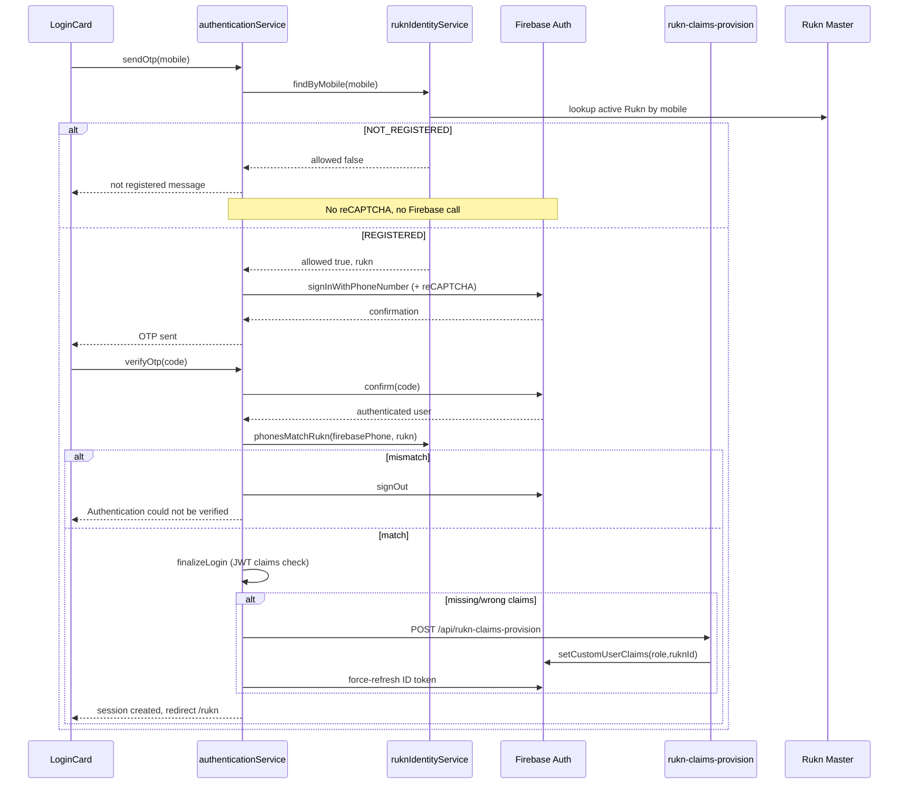
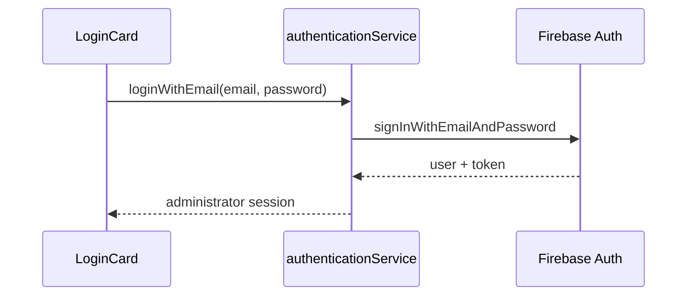

# Rukn Authentication — M7.1

## Authentication Constitution

| Principle | Rule |
|-----------|------|
| **Identity** | Firebase verifies phone ownership via OTP |
| **Authorization** | Karkun Connect grants access based on Rukn Master |
| **Login ID** | Registered mobile number in Rukn Master (AUTH-01) |
| **OTP gate** | OTP only after Rukn Master lookup succeeds (AUTH-02) |
| **Uniqueness** | One mobile per active Rukn (AUTH-03) |
| **Firebase boundary** | Unregistered numbers never reach Firebase (AUTH-04) |
| **Ownership** | Firebase proves the user controls the phone (AUTH-05) |
| **Access control** | Application authorizes role and `ruknId` (AUTH-06) |

## Sequence — Rukn Login



## KC-0100.3 — Automatic claim provisioning

After phone OTP, if the ID token lacks valid `role=rukn` / `ruknId` claims, the client requests server-side Admin provisioning (`/api/rukn-claims-provision`), force-refreshes the JWT, and re-runs the KC-0100 fail-closed gate. Claims are never invented on the client.

Full audit report: [kc-0100-3-activation-reliability.md](./kc-0100-3-activation-reliability.md).

## Sequence — Administrator Login (unchanged)



## Services

| Service | Responsibility |
|---------|----------------|
| `ruknIdentityService` | Normalize, validate, lookup Rukn Master — **no Firebase** |
| `ruknAuthAttemptLogger` | Structured audit log for every Rukn auth attempt (AUTH-07) |
| `authenticationService` | Orchestrates identity check → Firebase OTP → post-verify match |

## Business Rules

| ID | Rule |
|----|------|
| AUTH-01 | Registered mobile is the official Login ID |
| AUTH-02 | OTP is sent only after successful Rukn Master lookup |
| AUTH-03 | Each active Rukn has at most one registered mobile |
| AUTH-04 | Unregistered users never trigger Firebase Phone Auth |
| AUTH-05 | Firebase proves phone ownership only |
| AUTH-06 | Karkun Connect authorizes access via `roleResolver` |
| AUTH-07 | Every Rukn auth attempt is logged (`timestamp`, `mobile`, `result`, `registered`, `otpOutcome`, `userAgent`) |

## User Messages

| Condition | Message |
|-----------|---------|
| Not in Rukn Master | This mobile number is not registered with the campaign. Please contact the Administrator. |
| Post-OTP phone mismatch | Authentication could not be verified. |
| Invalid format | Mobile number must be exactly 10 digits. |

## Future Extension — Multi-Jamaat

`ruknIdentityService` is isolated from Firebase so a future `jamaatId` scope can be added to lookup without changing the OTP flow:

1. Extend Rukn Master with `jamaatId` (or separate store).
2. Pass campaign/jamaat context into `findByMobile()`.
3. Keep Firebase as identity verifier; authorization remains in Karkun Connect.

## Verification

```bash
npm run verify:rukn-identity
npm run verify:auth
```

## Related

- [Authentication (M7)](authentication.md)
- [Admin Setup](../operations/admin-setup.md)
