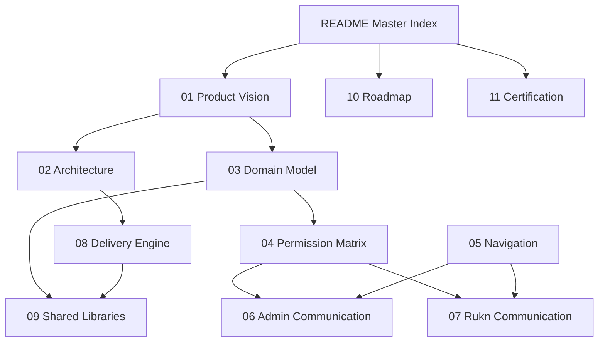

# KC-0090 — Karkun Communication Operating System
## Master Index

> **Initiative:** KC-0090 — Communication Operating System Product Specification  
> **Nature:** Documentation only  
> **Status:** Specification complete  
> **Code impact:** None

---

## Vision (One Paragraph)

**Karkun Communication Operating System (Karkun COS)** is a permanent platform capability of Karkun Connect. Communication is **relationship management driven by mission execution** — not messaging. Campaigns configure communication; communication does not belong to campaigns. Exactly two workspaces exist: **Admin Communication** (mission-wide) and **Rukn Communication** (Connected Karkuns only). Delivery is multi-channel (WhatsApp, SMS, Email) and channel-independent.

---

## Documentation Reading Order

| Order | Document | Why |
|-------|----------|-----|
| 1 | **[README.md](./README.md)** (this file) | Orientation and index |
| 2 | [01-product-vision.md](./01-product-vision.md) | Product meaning and principles |
| 3 | [02-architecture.md](./02-architecture.md) | Placement within frozen platform architecture |
| 4 | [03-domain-model.md](./03-domain-model.md) | Entities and Four Relationship Checks |
| 5 | [04-permission-matrix.md](./04-permission-matrix.md) | Admin vs Rukn scope |
| 6 | [05-navigation.md](./05-navigation.md) | Future IA only (no routes) |
| 7 | [06-admin-communication.md](./06-admin-communication.md) | Admin workspace spec |
| 8 | [07-rukn-communication.md](./07-rukn-communication.md) | Rukn workspace spec |
| 9 | [08-delivery-engine.md](./08-delivery-engine.md) | Multi-channel delivery architecture |
| 10 | [09-shared-libraries.md](./09-shared-libraries.md) | Reusable libraries and packs |
| 11 | [10-roadmap.md](./10-roadmap.md) | Phased future implementation |
| 12 | [11-documentation-certification.md](./11-documentation-certification.md) | Completeness & consistency certification |
| 13 | [KC-0091-CERTIFICATION.md](./KC-0091-CERTIFICATION.md) | Workspace foundation implementation certification |

### Quick paths

- **Stakeholder review:** README → 01 → 04 → 06 → 07  
- **Architecture review:** README → 02 → 03 → 08 → 09  
- **Implementation planning:** README → 10 → 02 → 11  

---

## Document Map



---

## Architecture Freeze (Non-Negotiable)

KC-0090 does **not**:

- Change architecture, repositories, Firestore schema, routing, authentication, or state management
- Introduce UI changes or placeholder screens
- Modify production code

If implementation needs those changes, **stop** and document an ADR — see [02-architecture.md](./02-architecture.md).

---

## Acceptance Criteria Checklist

| Criterion | Status |
|-----------|--------|
| Documentation only | Met |
| No production code changes | Met (verified at certification) |
| No architecture changes | Met |
| Terminology prefers **Connection** / **Connected Karkun** | Met |
| Rukn Communication centered on **Connected Karkuns** | Met |
| Multi-channel: WhatsApp, SMS, Email (not WhatsApp-only) | Met |
| Only Admin Communication and Rukn Communication workspaces | Met |

---

## Related Platform Documents

| Document | Relationship |
|----------|--------------|
| [Product Experience Constitution](../architecture/product-experience-constitution.md) | UX governance |
| [Automation Philosophy Charter](../architecture/automation-philosophy-charter.md) | Quiet assistance |
| [Execution Automation Framework](../architecture/execution-automation-framework.md) | Next-best-action generation |
| [Repository Layer](../architecture/repository-layer.md) | Persistence boundaries (unchanged) |
| [KC-003 Digital Rafeeq](../kc-003-digital-rafeeq/00-master-index.md) | Companion voice |
| [Documentation Hub](../README.md) | Project docs index |

---

## Inventory

```text
docs/communication/
├── README.md
├── 01-product-vision.md
├── 02-architecture.md
├── 03-domain-model.md
├── 04-permission-matrix.md
├── 05-navigation.md
├── 06-admin-communication.md
├── 07-rukn-communication.md
├── 08-delivery-engine.md
├── 09-shared-libraries.md
├── 10-roadmap.md
└── 11-documentation-certification.md
```
