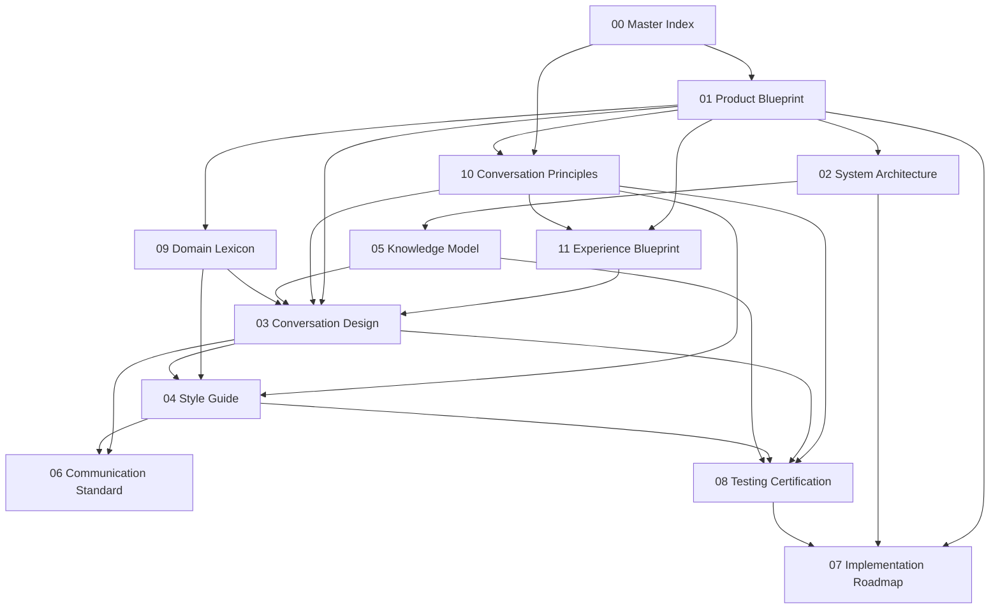

# KC-003 — Digital Rafeeq
## 00 — Master Index

> **Initiative:** KC-003 — Digital Rafeeq  
> **Document:** 00 — Master Index  
> **Sprint:** 0.1 — Documentation Refinement  
> **Status:** Draft

This document is the **entry point** for the entire KC-003 initiative. All other KC-003 documents link here.

---

## Vision

Digital Rafeeq will be an **Urdu-first digital companion** that helps Rukns perform campaign work through **respectful, natural conversation** — grounded in Karkun Connect's existing architecture and data.

Digital Rafeeq is **not a chatbot**. It is a campaign-aligned companion that speaks to people with dignity, uses correct domain knowledge, and defers to established business rules.

_[Detailed vision statement — to be finalized in [01-product-blueprint.md](./01-product-blueprint.md).]_

---

## Mission

To give every Rukn a **trustworthy conversational layer** — across chat, voice, WhatsApp, and future interaction surfaces — that makes campaign work clearer, more encouraging, and easier to complete without replacing Karkun Connect's core systems.

_[Detailed mission statement — to be finalized in [01-product-blueprint.md](./01-product-blueprint.md).]_

---

## Documentation Reading Order

Read documents in this order for a complete understanding of the KC-003 design specification:

| Order | Document | Why Read It |
|-------|----------|-------------|
| 1 | **[00-master-index.md](./00-master-index.md)** (this document) | Orientation, dependencies, status |
| 2 | [01-product-blueprint.md](./01-product-blueprint.md) | What Digital Rafeeq is and is not |
| 3 | [10-conversation-principles.md](./10-conversation-principles.md) | Constitutional rules for all interaction |
| 4 | [11-experience-blueprint.md](./11-experience-blueprint.md) | Complete Rukn experience — daily journey and emotional design |
| 5 | [02-system-architecture.md](./02-system-architecture.md) | Placement within Karkun Connect |
| 6 | [05-knowledge-model.md](./05-knowledge-model.md) | What the companion may know and cite |
| 7 | [09-domain-lexicon.md](./09-domain-lexicon.md) | Canonical campaign terminology |
| 8 | [03-conversation-design.md](./03-conversation-design.md) | Dialogue patterns and flows |
| 9 | [04-style-guide.md](./04-style-guide.md) | Urdu-first conversation style and tone |
| 10 | [06-communication-standard.md](./06-communication-standard.md) | Channel and messaging standards |
| 11 | [08-testing-certification.md](./08-testing-certification.md) | Quality and certification framework |
| 12 | [07-implementation-roadmap.md](./07-implementation-roadmap.md) | Phased delivery plan |

**Quick paths:**

- **Product / stakeholder review:** 00 → 01 → 11 → 10 → 07
- **Experience design:** 00 → 01 → 11 → 10 → 03 → 04
- **Conversation design:** 00 → 10 → 11 → 03 → 04 → 09
- **Technical placement:** 00 → 01 → 02 → 05 → 06
- **Quality / pilot readiness:** 00 → 10 → 08 → 07

---

## Document Dependency Map

| Document | Depends On | Informs |
|----------|------------|---------|
| [01-product-blueprint.md](./01-product-blueprint.md) | 00 | 02, 03, 07, 10, 11 |
| [10-conversation-principles.md](./10-conversation-principles.md) | 01 | 03, 04, 06, 08, 11 |
| [11-experience-blueprint.md](./11-experience-blueprint.md) | 01, 10 | 03, 04, 08 |
| [02-system-architecture.md](./02-system-architecture.md) | 01 | 05, 06, 07 |
| [05-knowledge-model.md](./05-knowledge-model.md) | 02 | 03, 08 |
| [09-domain-lexicon.md](./09-domain-lexicon.md) | 01 | 03, 04, 05 |
| [03-conversation-design.md](./03-conversation-design.md) | 01, 05, 10 | 04, 06, 08 |
| [04-style-guide.md](./04-style-guide.md) | 03, 09, 10 | 06, 08 |
| [06-communication-standard.md](./06-communication-standard.md) | 03, 04 | 08, 07 |
| [08-testing-certification.md](./08-testing-certification.md) | 03, 04, 05, 10 | 07 |
| [07-implementation-roadmap.md](./07-implementation-roadmap.md) | All | — |

---

## Document Library

| # | Document | Summary |
|---|----------|---------|
| 00 | [00-master-index.md](./00-master-index.md) | Entry point, reading order, status, decisions |
| 01 | [01-product-blueprint.md](./01-product-blueprint.md) | Product scope, personas, use cases, non-goals |
| 02 | [02-system-architecture.md](./02-system-architecture.md) | Architectural placement within Karkun Connect |
| 03 | [03-conversation-design.md](./03-conversation-design.md) | Dialogue patterns, flows, handoffs |
| 04 | [04-style-guide.md](./04-style-guide.md) | Urdu-first conversation style, tone, formatting |
| 05 | [05-knowledge-model.md](./05-knowledge-model.md) | Knowledge boundaries and sources of truth |
| 06 | [06-communication-standard.md](./06-communication-standard.md) | Channel policy, messaging, audit |
| 07 | [07-implementation-roadmap.md](./07-implementation-roadmap.md) | Phased delivery and pilot gates |
| 08 | [08-testing-certification.md](./08-testing-certification.md) | Quality rubric and certification |
| 09 | [09-domain-lexicon.md](./09-domain-lexicon.md) | Canonical terminology |
| 10 | [10-conversation-principles.md](./10-conversation-principles.md) | Constitutional conversation principles |
| 11 | [11-experience-blueprint.md](./11-experience-blueprint.md) | Complete Rukn experience — daily journey, emotional design |

---

## Current Sprint Status

| Sprint | Name | Status | Notes |
|--------|------|--------|-------|
| 0 | Documentation Foundation | **Complete** | Documents 01–09 created with structure and placeholders |
| 0.1 | Documentation Refinement | **Complete** | Master index, conversation principles, cross-references, terminology |
| 0.2 | Experience Blueprint | **Complete** | [11-experience-blueprint.md](./11-experience-blueprint.md) — full Rukn experience definition |
| 1+ | _TBD_ | Not started | Design and implementation phases — see [07-implementation-roadmap.md](./07-implementation-roadmap.md) |

---

## Approval Status

| Gate | Owner | Status | Date |
|------|-------|--------|------|
| Documentation structure (Sprint 0) | _TBD_ | Pending review | — |
| Documentation refinement (Sprint 0.1) | _TBD_ | Pending review | — |
| Experience blueprint (Sprint 0.2) | _TBD_ | Pending review | — |
| Product blueprint sign-off | _TBD_ | Not started | — |
| Architecture review | _TBD_ | Not started | — |
| Pilot certification | _TBD_ | Not started | — |

---

## Decision Log

| ID | Date | Decision | Rationale | Documents Affected |
|----|------|----------|-----------|-------------------|
| KC003-D001 | 2026-07-17 | Digital Rafeeq is a companion, not a chatbot | Campaign-aligned, respectful interaction; avoid generic Q&A posture | All |
| KC003-D002 | 2026-07-17 | Urdu-first language policy | Primary audience is Rukns; English as secondary where needed | 04, 09, 10 |
| KC003-D003 | 2026-07-17 | Reuse Karkun Connect architecture | No parallel systems; companion layer on existing repos/stores | 02, 05 |
| KC003-D004 | 2026-07-17 | Interface-agnostic conversation layer | Support chat, voice, WhatsApp, and future surfaces without doc rewrites | 02, 03, 04, 06 |
| KC003-D005 | 2026-07-17 | [10-conversation-principles.md](./10-conversation-principles.md) is constitutional | All dialogue and copy must pass the Rafeeq Test | 03, 04, 08, 10 |
| KC003-D006 | 2026-07-17 | [11-experience-blueprint.md](./11-experience-blueprint.md) defines experience before implementation | Experience-first design; no guilt, no pressure, companion not software | 03, 04, 08, 11 |

---

## Open Questions

| ID | Question | Owner | Status |
|----|----------|-------|--------|
| OQ-001 | Which interaction surface ships first — in-app chat, voice, or WhatsApp? | _TBD_ | Open |
| OQ-002 | What is the pilot geography and Rukn cohort? | _TBD_ | Open |
| OQ-003 | How much proactive messaging is appropriate per day? | _TBD_ | Open |
| OQ-004 | Final Urdu script preference (Nastaliq vs Naskh) for conversation UI? | _TBD_ | Open |
| OQ-005 | Administrator visibility into companion conversations? | _TBD_ | Open |

---

## Future Milestones

| Milestone | Target | Depends On |
|-----------|--------|------------|
| Documentation sign-off | _TBD_ | Sprint 0.1 complete |
| Detailed product & conversation design | _TBD_ | Doc sign-off |
| Architecture review | _TBD_ | 02, 05 finalized |
| MVP interaction surface | _TBD_ | Design + architecture approval |
| Pilot launch | _TBD_ | [08-testing-certification.md](./08-testing-certification.md) pass |
| General availability | _TBD_ | Pilot success gates |

---

## Revision History

| Version | Date | Author | Notes |
|---------|------|--------|-------|
| 0.1 | 2026-07-17 | _TBD_ | Sprint 0 — initial doc set (01–09) |
| 0.2 | 2026-07-17 | _TBD_ | Sprint 0.1 — master index, principles, cross-references |
| 0.3 | 2026-07-17 | _TBD_ | Sprint 0.2 — experience blueprint (11) |
