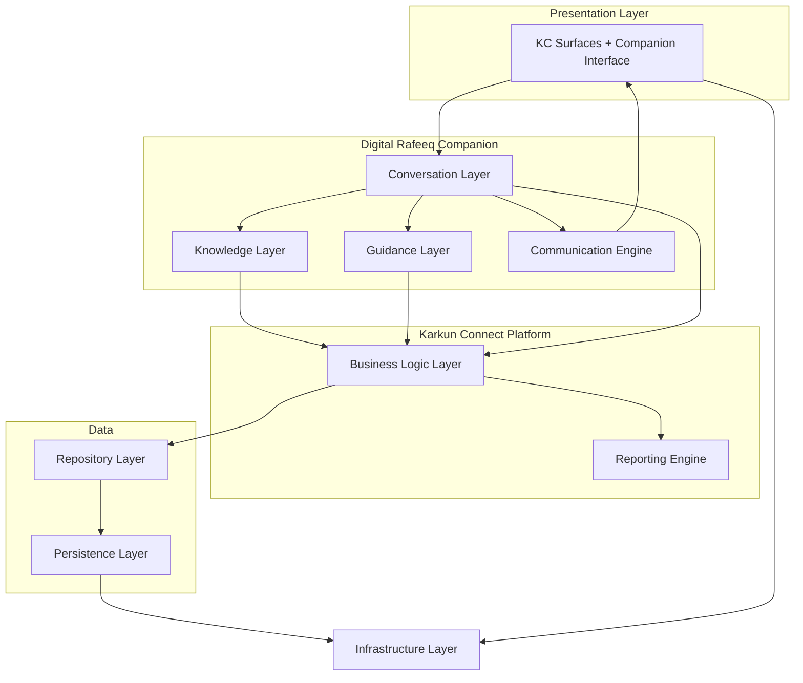
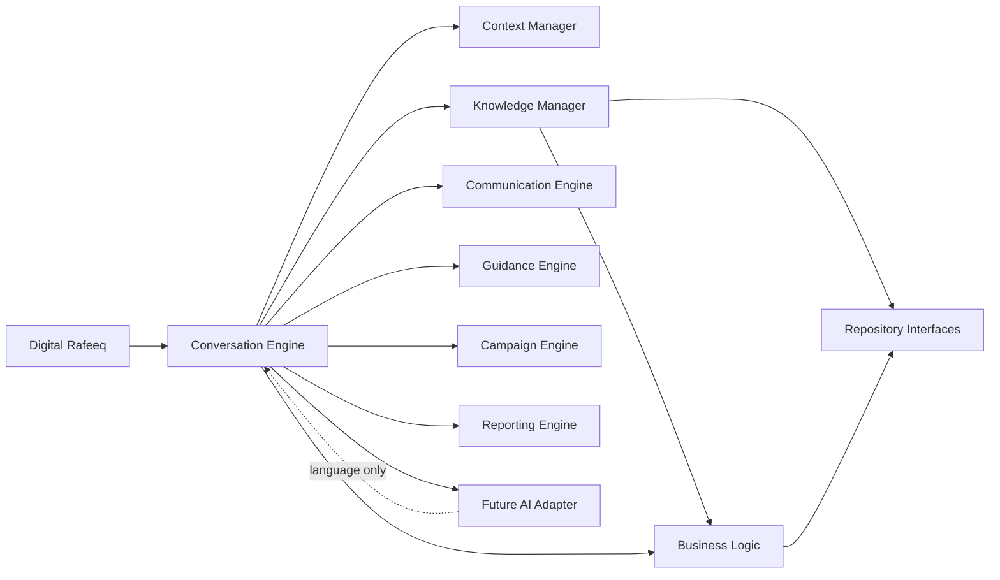
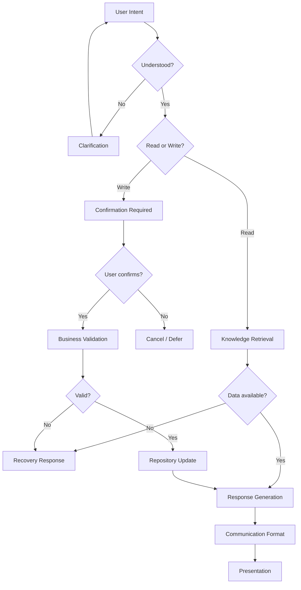

# KC-003 — Digital Rafeeq
## 02 — System Architecture

> **Initiative:** [KC-003 — Digital Rafeeq](./00-master-index.md)  
> **Document:** 02 — System Architecture  
> **Sprint:** 0.9 — Digital Rafeeq System Architecture  
> **Status:** Draft — conceptual architecture reference  
> **Master index:** [00-master-index.md](./00-master-index.md)

This document defines the **high-level architecture** of Digital Rafeeq within Karkun Connect.

It is a **conceptual architecture document**. It explains how major capabilities interact. It does **not** define implementation details, APIs, database schemas, or technology choices.

**Reading order:** Read after [01-product-blueprint.md](./01-product-blueprint.md) and [10-conversation-principles.md](./10-conversation-principles.md), before [05-knowledge-model.md](./05-knowledge-model.md).

Aligned with [05-knowledge-model.md](./05-knowledge-model.md), [03-conversation-design.md](./03-conversation-design.md), [06-communication-standard.md](./06-communication-standard.md), and [11-experience-blueprint.md](./11-experience-blueprint.md).

---

## Document Control

| Field | Value |
|-------|-------|
| Document type | Conceptual System Architecture |
| Scope | Digital Rafeeq within Karkun Connect |
| Authority | Repositories remain single source of truth |
| Exclusions | No code, APIs, schemas, or technology lock-in |

---

## 1. Architectural Vision

Digital Rafeeq is introduced as a **companion layer** on top of the existing Karkun Connect operational platform — not as a replacement, fork, or parallel system.

### Guiding Principles

| Principle | Architectural meaning |
|-----------|----------------------|
| **Digital Rafeeq is a companion layer** | New capability orchestrates human interaction; core platform remains |
| **Karkun Connect remains the operational platform** | Assignments, compliance, execution, dashboards, and workflows persist |
| **Repositories remain the single source of truth** | All factual claims trace to repository-backed state ([05-knowledge-model.md](./05-knowledge-model.md)) |
| **Conversation orchestrates user interaction** | The Rukn experiences campaign work through dialogue — not through duplicated logic |
| **Business rules remain independent of AI** | Validation, authorization, and workflow gates live in business logic — not in language models |
| **Gradual enhancement without disruption** | Companion capabilities can be added incrementally without rewriting existing workflows |

### Vision Summary

```
┌─────────────────────────────────────────────────────────────┐
│              Digital Rafeeq — Companion Layer                │
│     (conversation, guidance voice, communication policy)   │
├─────────────────────────────────────────────────────────────┤
│           Karkun Connect — Operational Platform              │
│   (business logic, stores, services, existing UI surfaces)   │
├─────────────────────────────────────────────────────────────┤
│              Repository Layer — Source of Truth              │
├─────────────────────────────────────────────────────────────┤
│                    Persistence / Infrastructure              │
└─────────────────────────────────────────────────────────────┘
```

The companion **reads** truth, **proposes** actions, **formats** communication, and **orchestrates** dialogue. It does **not** own campaign records.

---

## 2. Major Architectural Layers

Eight conceptual layers stack from user-facing interaction to infrastructure. Each layer has a strict boundary.

---

### Presentation Layer

| Dimension | Definition |
|-----------|------------|
| **Purpose** | Surfaces through which Rukns and Administrators interact with Karkun Connect |
| **Responsibilities** | Render UI; capture user input; display companion messages, notifications, dashboards |
| **Inputs** | User gestures; formatted messages from Communication Engine; existing KC screen state |
| **Outputs** | User intent events; navigation; display of grounded content |
| **Dependencies** | Conversation Layer; existing KC pages and components |
| **Boundaries** | **No repository access.** **No business rule evaluation.** Presentation displays only |

---

### Conversation Layer

| Dimension | Definition |
|-----------|------------|
| **Purpose** | Orchestrate Digital Rafeeq dialogue — lifecycle, patterns, confirmation, recovery |
| **Responsibilities** | Turn-taking; intent routing; clarification; confirmation flows; session context |
| **Inputs** | User intent; Context Manager state; Knowledge Manager facts; Business validation results |
| **Outputs** | Conversation acts (guide, ask, confirm); requests to Communication Engine |
| **Dependencies** | Guidance Layer; Knowledge Layer; Business Logic Layer (validation only) |
| **Boundaries** | **No business logic.** **No direct persistence.** **No invented facts** |

---

### Guidance Layer

| Dimension | Definition |
|-----------|------------|
| **Purpose** | Determine what deserves attention — today's programme, journey posture, coaching insights |
| **Responsibilities** | Synthesize priorities from assignments, guidance state, follow-ups, campaign context |
| **Inputs** | Derived data from Business Logic Layer; campaign timeline |
| **Outputs** | Guidance snapshots; suggested focus; rhythm triggers for Conversation Layer |
| **Dependencies** | Business Logic Layer; Campaign Engine concepts |
| **Boundaries** | Read-only synthesis; does not mutate state; does not replace existing guidance engine rules |

---

### Knowledge Layer

| Dimension | Definition |
|-----------|------------|
| **Purpose** | Retrieve, scope, and validate facts for companion use |
| **Responsibilities** | Knowledge Manager; permission checks; freshness; grounding enforcement |
| **Inputs** | Repository reads; service queries; user role and Rukn scope |
| **Outputs** | Grounded fact bundles; uncertainty signals; prohibited-claim blocks |
| **Dependencies** | Repository Layer (via Business Logic access patterns); [05-knowledge-model.md](./05-knowledge-model.md) |
| **Boundaries** | **No parallel truth store.** Conversation memory is not authoritative |

---

### Business Logic Layer

| Dimension | Definition |
|-----------|------------|
| **Purpose** | Enforce campaign rules — what is valid, allowed, and consistent |
| **Responsibilities** | Assignment rules; journey transitions; compliance validation; authorization scope |
| **Inputs** | Repository state; proposed actions from Conversation Layer |
| **Outputs** | Validation results (permit/deny/defer); state mutations via defined workflows |
| **Dependencies** | Repository Layer; existing KC services and stores |
| **Boundaries** | **Independent of AI.** AI never validates or authorizes here |

---

### Repository Layer

| Dimension | Definition |
|-----------|------------|
| **Purpose** | Authoritative domain persistence interfaces |
| **Responsibilities** | Campaign, Rukn, Karkun, Connection, Execution, Communication, Compliance, Settings domains |
| **Inputs** | Validated write requests from Business Logic Layer |
| **Outputs** | Domain records; query results; activity history |
| **Dependencies** | Persistence Layer |
| **Boundaries** | **Single source of truth.** No companion-specific duplicate repositories |

**Conceptual repository domains (existing KC):** Campaign · Rukn · Karkun · Connection · Execution · Communication · Compliance · Settings

---

### Persistence Layer

| Dimension | Definition |
|-----------|------------|
| **Purpose** | Physical storage of repository data |
| **Responsibilities** | Durability; sync; backup — technology-agnostic at this document level |
| **Inputs** | Repository operations |
| **Outputs** | Persisted records; availability signals |
| **Dependencies** | Infrastructure Layer |
| **Boundaries** | Accessed only through Repository Layer — never from Presentation or Conversation |

---

### Infrastructure Layer

| Dimension | Definition |
|-----------|------------|
| **Purpose** | Runtime, network, authentication transport, messaging delivery |
| **Responsibilities** | Hosting; connectivity; auth token transport; push/WhatsApp delivery pipes |
| **Inputs** | Platform operations |
| **Outputs** | Availability; delivery; identity context to upper layers |
| **Dependencies** | External providers (conceptual) |
| **Boundaries** | Does not contain campaign business meaning |

---

### Layer Diagram



---

## 3. Core Components

Conceptual components and their responsibilities. Components may map to existing KC capabilities or future companion modules — this document names **roles**, not implementations.

---

### Digital Rafeeq

| Attribute | Definition |
|-----------|------------|
| **Responsibility** | Umbrella companion capability — the Rukn-facing experience of supported, respectful campaign dialogue |
| **Owns** | Nothing persistent |
| **Coordinates** | Conversation Engine, Guidance integration, Knowledge Manager, Communication Engine |

---

### Conversation Engine

| Attribute | Definition |
|-----------|------------|
| **Responsibility** | Execute conversation lifecycle ([03-conversation-design.md](./03-conversation-design.md)) — greeting through recovery |
| **Owns** | Session dialogue state (non-authoritative) |
| **Does not own** | Business rules; repository records |

---

### Guidance Engine (Integration)

| Attribute | Definition |
|-----------|------------|
| **Responsibility** | Existing KC capability — journey stages, urgency, coaching signals |
| **Companion role** | Consumes guidance output for today's programme and preparation |
| **Does not duplicate** | Journey calculation rules |

---

### Knowledge Manager

| Attribute | Definition |
|-----------|------------|
| **Responsibility** | Enforce knowledge model — retrieve, scope, ground, block prohibited claims |
| **Owns** | Retrieval orchestration policy |
| **Does not own** | Domain data |

---

### Context Manager

| Attribute | Definition |
|-----------|------------|
| **Responsibility** | Maintain conversation context — current objective, Karkun focus, deferrals ([03-conversation-design.md](./03-conversation-design.md) Section 6) |
| **Owns** | Ephemeral session context |
| **Does not own** | Authoritative assignment or meeting state |

---

### Communication Engine

| Attribute | Definition |
|-----------|------------|
| **Responsibility** | Format outbound messages per [06-communication-standard.md](./06-communication-standard.md) — all channels |
| **Owns** | Template application; DRCS checklist enforcement |
| **Does not own** | Message facts — receives grounded content from Conversation/Knowledge path |

---

### Campaign Engine (Integration)

| Attribute | Definition |
|-----------|------------|
| **Responsibility** | Existing KC capability — active campaign, timeline, progress metrics |
| **Companion role** | Supplies campaign day, milestone, progress context |
| **Does not duplicate** | Campaign repository ownership |

---

### Reporting Engine (Integration)

| Attribute | Definition |
|-----------|------------|
| **Responsibility** | Existing KC capability — compliance and execution aggregates |
| **Companion role** | Supplies grounded report summaries when Rukn asks |
| **Does not duplicate** | Compliance calculation rules |

---

### Repository Interfaces

| Attribute | Definition |
|-----------|------------|
| **Responsibility** | Domain persistence contracts — existing KC repository pattern |
| **Companion role** | Read for grounding; write only through Business Logic after confirmation |
| **Authority** | **Highest** — per [05-knowledge-model.md](./05-knowledge-model.md) |

---

### Future AI Adapter

| Attribute | Definition |
|-----------|------------|
| **Responsibility** | Language understanding and response refinement only |
| **Owns** | Ephemeral interpretation artifacts |
| **Must never** | Authorize actions; replace repository lookup; persist generated facts |

See [05-knowledge-model.md](./05-knowledge-model.md) Section 8.

---

### Component Relationship Diagram



---

## 4. Information Flow

### Normal Flow (Read — e.g. "Who should I meet first?")

```
User Intent
    → Presentation Layer (capture)
    → Conversation Engine (understand)
    → Context Manager (scope session)
    → Knowledge Manager (request facts)
    → Business Logic Layer (authorize read scope)
    → Repository Interfaces (retrieve)
    → Knowledge Manager (ground bundle)
    → Conversation Engine (guidance act)
    → Communication Engine (format per DRCS)
    → Presentation Layer (display)
```

### Normal Flow (Write — e.g. "Record this meeting")

```
User Intent
    → Conversation Engine (understand + clarify)
    → Knowledge Manager (retrieve existing state)
    → Conversation Engine (confirmation pattern)
    → User explicit confirm
    → Business Logic Layer (validate action)
    → Repository Interfaces (persist via existing workflow)
    → Communication Engine (completion message)
    → Presentation Layer (display)
```

**Critical rule:** Write path never skips Business Logic or Confirmation.

---

### Exceptional Flows

| Exception | Flow adjustment |
|-----------|-----------------|
| **Ambiguous intent** | Conversation Engine → clarification → resume normal flow |
| **Repository unavailable** | Knowledge Manager signals failure → Conversation recovery → no fabricated response |
| **Permission denied** | Business Logic denies → Communication Engine error pattern → no data leak |
| **Offline** | Infrastructure signal → Conversation defer write → honest limit message |
| **AI adapter low confidence** | Fallback to clarification question — never guess |
| **Cancelled confirmation** | Clear pending state → Conversation closing → no write |

### Exception Flow Diagram



---

## 5. Separation of Responsibilities

| Concern | Owner | Does NOT own |
|---------|-------|--------------|
| **How to communicate** | Conversation Layer + Communication Engine | Facts, validation, persistence |
| **What is valid** | Business Logic Layer | Dialogue tone, message formatting |
| **What is true** | Repository Layer | Conversation phrasing |
| **How messages are formatted** | Communication Engine (DRCS) | Business decisions |
| **Language interpretation** | Future AI Adapter | Authorization, facts, persistence |
| **What user sees on screens** | Presentation Layer | Direct data access |

### AI Boundaries (Non-Negotiable)

| AI may | AI must never |
|--------|---------------|
| Interpret Urdu intent | Authorize actions |
| Refine phrasing for Rafeeq Test | Replace repository lookup |
| Summarize grounded records | Persist generated content |
| Assist disambiguation questions | Expand permission scope |

---

## 6. Design Principles

| Principle | Application |
|-----------|-------------|
| **Single Source of Truth** | Repositories authoritative; companion has no parallel registry |
| **Separation of Concerns** | Conversation, business logic, persistence, communication are distinct |
| **Composable Components** | Conversation Engine + Knowledge Manager + Communication Engine compose without merging |
| **Repository Pattern** | All domain access through repository interfaces — existing KC pattern preserved |
| **Least Privilege** | Rukn scope enforced at Knowledge Manager and Business Logic — every retrieval |
| **Evidence-Based Responses** | Every fact traced to repository or rule-bound derivation ([05-knowledge-model.md](./05-knowledge-model.md)) |
| **Extensibility** | New channels (voice, email) attach at Presentation + Communication without changing repositories |
| **Technology Independence** | This architecture holds regardless of storage, AI provider, or UI framework |

---

## 7. Future Extension Points

Extension points allow capability growth **without changing overall architecture**.

| Extension | Integration point | Architecture unchanged |
|-----------|-------------------|------------------------|
| **Voice** | Presentation Layer input/output + Communication Engine tone adaptation | Layers, repositories, business rules |
| **Multilingual Support** | Communication Engine + AI Adapter language module | Source of truth, validation path |
| **Offline Assistant** | Knowledge Manager cache policy + Conversation defer-write | Repository authority when online |
| **Advanced Analytics** | Reporting Engine → read-only insights to Guidance Layer | No analytics-owned truth |
| **External Integrations** | Infrastructure Layer adapters → Business Logic gates | No bypass of validation |
| **Future AI Providers** | Swap AI Adapter implementation | Adapter contract unchanged |

### Extension Rule

> New capability attaches at **Presentation**, **Communication**, or **AI Adapter** — never between **Business Logic** and **Repository** without validation.

---

## 8. Architecture Constraints

Hard constraints for all Digital Rafeeq implementation work.

| Constraint | Rationale |
|------------|-----------|
| **No business logic inside conversations** | Conversation orchestrates; Business Logic validates |
| **No repository access from presentation** | Prevents UI-to-data coupling; preserves KC patterns |
| **No AI-generated persistence** | AI output is not truth ([05-knowledge-model.md](./05-knowledge-model.md)) |
| **No direct UI-to-database coupling** | All writes through Business Logic → Repository |
| **No duplicate sources of truth** | Companion does not maintain assignment/compliance registry |
| **No autonomous writes** | Confirmation required before persistence ([03-conversation-design.md](./03-conversation-design.md) Section 7) |
| **No KC-001 lifecycle bypass** | Refresh, hydration, assignment store patterns remain untouched unless separate approved initiative |
| **No authentication change** | Identity context consumed; auth architecture unchanged |

---

## 9. Example Request Journey

**Scenario:** Rukn opens the application and asks to record a meeting with a Connected Karkun.

*Conceptual walkthrough — no implementation.*

---

### Stage 1 — Rukn Opens Application

| Layer | Activity |
|-------|----------|
| **Presentation** | Application surface loads; companion interface available |
| **Infrastructure** | Auth context established (unchanged KC flow) |
| **Conversation** | Rhythm trigger: morning / arrival — optional greeting per [11-experience-blueprint.md](./11-experience-blueprint.md) |

---

### Stage 2 — Digital Rafeeq Greets

| Layer | Activity |
|-------|----------|
| **Conversation** | Greeting pattern; no task dump |
| **Guidance** | Optional today's programme snapshot requested |
| **Knowledge** | Campaign day, Rukn scope loaded |
| **Communication** | DRCS greeting formatted |
| **Presentation** | Greeting displayed |

---

### Stage 3 — Rukn Asks to Record a Meeting

| Layer | Activity |
|-------|----------|
| **Presentation** | Utterance captured: *"احمد صاحب سے ملاقات ہوئی"* |
| **Future AI Adapter** | (Optional) Intent classified: meeting recording |
| **Conversation** | Understanding stage; may need clarification if multiple Ahmads |
| **Context** | Current objective → meeting recording |

---

### Stage 4 — Knowledge Retrieved

| Layer | Activity |
|-------|----------|
| **Knowledge Manager** | Disambiguate Karkun if needed; load assignment, journey stage, prior history |
| **Business Logic** | Authorize read — Rukn owns this connection |
| **Repository** | Connection + execution records retrieved |
| **Knowledge Manager** | Grounded bundle returned — no meeting recorded yet today |

---

### Stage 5 — Business Rules Validated

| Layer | Activity |
|-------|----------|
| **Conversation** | Question pattern: how did meeting go? |
| **Business Logic** | (Deferred until confirm) Pre-validate: active assignment exists; recording pathway permitted |

---

### Stage 6 — Confirmation Requested

| Layer | Activity |
|-------|----------|
| **Conversation** | Confirmation pattern: summarize what will be saved |
| **Communication** | Natural Urdu confirmation per [04-style-guide.md](./04-style-guide.md) |
| **Presentation** | Rukn sees clear yes/no choice |

---

### Stage 7 — Repository Updated

| Layer | Activity |
|-------|----------|
| **Presentation** | Rukn confirms |
| **Business Logic** | Validate submission; apply existing execution workflow |
| **Repository** | Meeting outcome persisted through Execution domain |
| **Guidance** | Journey may advance per existing rules (not companion-decided) |

---

### Stage 8 — Communication Generated

| Layer | Activity |
|-------|----------|
| **Communication** | Completion message; encouragement pattern |
| **Conversation** | Closing segment; offer next contact scheduling |
| **Presentation** | Success displayed — companion voice, not "sync successful" |

---

### Journey Summary

```
Open → Greet → Intent → Retrieve → Validate → Confirm → Persist → Communicate
         ↑                              ↓
         └──────── Recovery (if any step fails) ────────┘
```

---

## 10. Success Criteria

This architecture is **complete** when an engineer can answer the following **without reading implementation code**:

| Question | Answer location |
|----------|-----------------|
| What are system boundaries? | Sections 2, 5, 8 |
| What does each component do? | Section 3 |
| How does information flow? | Section 4 |
| Where do extensions attach? | Section 7 |
| What is authoritative? | Repository Layer — Sections 1, 5, 6 |
| Where does AI fit? | Future AI Adapter — Sections 3, 5, 8 |
| What is a full request journey? | Section 9 |

### Document Acceptance Checklist

- [x] Architectural vision and principles (Section 1)
- [x] Eight layers with purpose, I/O, boundaries (Section 2)
- [x] Core components defined (Section 3)
- [x] Normal and exceptional information flows (Section 4)
- [x] Separation of responsibilities including AI (Section 5)
- [x] Eight design principles (Section 6)
- [x] Future extension points (Section 7)
- [x] Hard constraints (Section 8)
- [x] Example request journey (Section 9)
- [x] No code, APIs, schema, or technology choices

---

## Implementation Impact

This document informs future work but does not specify builds.

### Impacts

| Area | Architectural direction |
|------|-------------------------|
| **Future Conversation Engine** | Section 3 Conversation Engine; Section 4 flows |
| **Guidance Engine integration** | Read-only consumption; Section 3 |
| **Communication Engine** | DRCS formatting layer; Section 3 |
| **AI Adapter** | Section 3, 5, 7, 8 boundaries |
| **Repository Integration** | Knowledge Manager read path; Business Logic write path |
| **Presentation Layer** | Companion interface; no direct repository access |

### Does NOT Impact

| Area | Reason |
|------|--------|
| **Firestore schema** | Conceptual architecture only |
| **Authentication flow** | Consumes identity; does not redesign auth |
| **Existing campaign business rules** | Business Logic remains authoritative and unchanged by this initiative's architecture doc |

---

## Architecture Review Checklist

| Check | Result |
|-------|--------|
| ✓ Clear layer responsibilities | Section 2 — eight layers with explicit boundaries |
| ✓ No overlapping ownership | Section 5 separation table |
| ✓ Repository remains authoritative | Sections 1, 4, 5, 6, 8 |
| ✓ AI clearly separated from business rules | Sections 3, 5, 8 |
| ✓ Future extension points identified | Section 7 |
| ✓ No technology lock-in | Section 6 Technology Independence; no stack prescribed |

**Architecture review: PASS** — conceptual architecture complete and internally consistent.

---

## Related Documents

| Document | Role |
|----------|------|
| [00-master-index.md](./00-master-index.md) | Initiative entry point |
| [01-product-blueprint.md](./01-product-blueprint.md) | Product WHY — companion on KC platform |
| [03-conversation-design.md](./03-conversation-design.md) | Conversation Engine behaviour |
| [05-knowledge-model.md](./05-knowledge-model.md) | Knowledge Manager policy |
| [06-communication-standard.md](./06-communication-standard.md) | Communication Engine policy |
| [07-implementation-roadmap.md](./07-implementation-roadmap.md) | Delivery sequencing |
| [09-domain-lexicon.md](./09-domain-lexicon.md) | Domain terminology |
| [10-conversation-principles.md](./10-conversation-principles.md) | Constitutional rules |
| [11-experience-blueprint.md](./11-experience-blueprint.md) | Human experience architecture serves |

---

## Revision History

| Version | Date | Author | Notes |
|---------|------|--------|-------|
| 0.1 | 2026-07-17 | _TBD_ | Sprint 0 — structure and placeholders |
| 0.2 | 2026-07-17 | _TBD_ | Sprint 0.1 — conversation layer terminology |
| 1.0 | 2026-07-17 | _TBD_ | Sprint 0.9 — complete conceptual system architecture |
